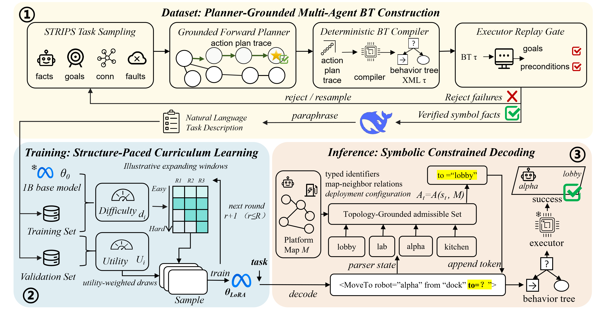

# CLIMB: Curriculum Learning for Multi-Agent Behavior Tree Generation with Small Language Models (ICASSP 2027 under review)

<div align="center">
  
</div>

**🌍 Project page:** [yichenwang2002.github.io/CLIMB](https://yichenwang2002.github.io/CLIMB/)

CLIMB turns a 1B-parameter language model into a reliable generator of
**executable** BehaviorTree.CPP v4 trees for 2–3 robot teams, by grounding all
three stages in symbolic planning:

- **Supervision** — a planner-grounded corpus: missions are sampled from a
  STRIPS domain, solved by forward search, compiled to behavior trees, and
  kept only if a symbolic executor reaches every mission goal with faults
  active;
- **SPCL** (Structure-Paced Curriculum Learning, training) — examples are
  ordered and weighted by a two-view difficulty score (semantic surprise ⊕
  structural complexity) with validation-referenced utility controlling
  bucket exposure;
- **SCD** (Symbolic Constrained Decoding, inference) — decoding masks
  identifiers and transitions that violate the platform map, at zero extra
  token cost.

The primary metric is **execution success**: a generated tree counts only if
it parses, ticks to `SUCCESS`, and reaches all mission goals.

## Repository layout

```
CLIMB/
│
├── data/                      # benchmark: executor-verified mission–tree pairs
│   ├── train.jsonl            #   6,000 training missions (4 seen domains)
│   ├── val.jsonl              #     600 validation missions
│   ├── test.jsonl             #   480 held-out multi-agent missions (2 unseen domains)
│   └── README.md              #   format, statistics, checksums
│
├── datagen/                   # corpus construction (how data/ was built)
│   ├── strips/                #   STRIPS domains, forward-search planner, task sampler
│   ├── executor.py            #   symbolic executor (the frozen judge for everything)
│   ├── build_dataset.py       #   sample → plan → compile → validate → rewrite NL
│   ├── rename_skills.py       #   primitive-renaming augmentation
│   └── nl_gen.py, names.py    #   natural-language mission rewriting
│
├── curriculum/                # SPCL (training-side contribution)
│   ├── score_mt_ducl.py       #   two-view difficulty + validation-referenced utility
│   ├── build_spcl.py          #   bucketing, expanding windows, paced sampling
│   └── structural.py          #   tree-structural features
│
├── training/                  # LoRA supervised fine-tuning
│   └── sft_lora.py            #   flat (baseline) and staged (SPCL) modes
│
├── eval/                      # evaluation
│   ├── evaluate.py            #   symbolic-execution success rate
│   ├── eval_constrained.py    #   SCD constrained decoding
│   ├── diagnose.py            #   failure-reason analysis
│   └── paired_test.py         #   exact McNemar paired significance
│
├── common/                    # shared helpers (data formats, API wrapper)
├── scripts/                   # minimal entry scripts (see below)
├── docs/                      # project page (GitHub Pages) + paper PDF
└── tests/                     # CPU-only smoke tests
```

## Usage

This repository is a **reference framework**: the complete pipeline is
included, but exact hyperparameters (curriculum schedule, learning rate, LoRA
configuration) are withheld at the current stage — the entry scripts mark
every place where you need to plug in your own values.

```bash
pip install -r requirements.txt
python tests/test_core_smoke.py     # CPU-only sanity check, no GPU needed

# 1. flat SFT baseline
bash scripts/run_flat.sh

# 2. SPCL curriculum + staged training
bash scripts/run_spcl.sh

# 3. evaluate (execution success) and SCD constrained decoding
bash scripts/run_eval.sh  outputs/checkpoints/spcl_s42/stage3 spcl_s42
bash scripts/run_scd.sh   outputs/checkpoints/spcl_s42/stage3 spcl_s42_scd
```

Backbones are pulled from the Hugging Face Hub, or pointed at local snapshots
via `CLIMB_BASE_MODEL` / `CLIMB_ENCODER`. Everything runs on a single 24 GB
GPU.

## Dataset

`data/` contains the executor-verified benchmark used in the paper:
**6,000** training missions (4 seen domains), **600** validation missions,
and a **480-task** held-out multi-agent suite in two unseen domains
(library, greenhouse) — 320 relay-transport + 160 joint-heavy-transport
missions, 357 of them with injected recoverable faults. A generated tree
counts as successful only if the shared symbolic executor reaches every
mission goal. See [`data/README.md`](data/README.md) for the record format,
statistics, and checksums.
